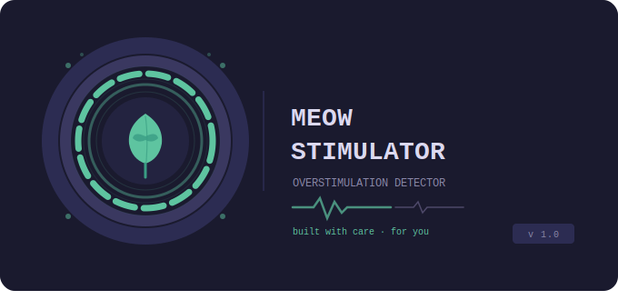

<div align="center">

<div align="center">
  
</div>

**Your body knows you're stressed before you do.**  
MeowStimulator watches for the signs — and gently reminds you to take care of yourself.

[](https://python.org)
[](https://mediapipe.dev)
[](LICENSE)
[](https://github.com)

</div>

---

## 🌿 What is this?

MeowStimulator is a real-time stress & overstimulation detector that runs quietly in the background while you work. Using your webcam and computer vision, it tracks three physical signals that your body produces under stress — often before you consciously notice anything is wrong.

When the signs cross a threshold you choose, it sends you a gentle nudge:
- A soft desktop notification
- A Telegram message with a suggested break activity
- A calm two-tone sound cue

Built with care for people who experience sensory sensitivity, anxiety, or rapid stress build-up. No accounts. No cloud. Everything runs locally on your machine.

---

## ✨ Features

| Feature | Description |
|---|---|
| 👁️ **Real-time detection** | Analyses face + body via webcam at ~20fps |
| 😤 **Facial stress scoring** | Measures brow furrow and lip compression |
| 👀 **Blink rate tracking** | Rapid blinking is an early stress signal |
| 🔄 **Repetitive movement** | Detects rocking and flapping-like velocity spikes |
| 🔔 **Alert threshold slider** | You set the sensitivity — 30% to 90% |
| ⏰ **Scheduled reminders** | Proactive nudges every 10–120 min (you choose) |
| ✈️ **Telegram alerts** | Rich messages sent straight to your phone |
| 🖥️ **Desktop notifications** | Windows native popups via Plyer |
| 🔊 **Soft sound cue** | Gentle 440Hz → 528Hz chime, never jarring |
| 🎨 **Autism-friendly UI** | Muted palette, stable layout, no flashing |
| 🌿 **Embedded icon** | No external files — icon generated at runtime |
| ↺ **Reset & pause** | Full control at all times |

---

## 📸 Screenshot

```
┌─────────────────────────────┬──────────────────────────────┐
│  🌿 MEOW STIMULATOR         │   OVERSTIMULATION LEVEL      │
│  overstimulation detector   │                              │
├─────────────────────────────│        ◉  Score: 42          │
│  ▶ START MONITORING         │        WATCH  🟡             │
│  ↺ RESET SCORE              ├──────────────────────────────│
│                             │  SIGNALS                     │
│  ┌───────────────────────┐  │  😤 Facial stress    ████ 40 │
│  │                       │  │  👁  Eye/blink rate   █   0  │
│  │   [ camera feed ]     │  │  🔄 Movement         ██  20  │
│  │                       │  ├──────────────────────────────│
│  │  face mesh overlay    │  │  🔔 ALERT THRESHOLD    65%   │
│  │  pose landmarks       │  │  ████████████░░░░░░░░░░░░   │
│  └───────────────────────┘  ├──────────────────────────────│
│                             │  ⏰ NEXT REMINDER   42:18    │
└─────────────────────────────┴──────────────────────────────┘
```

---

## 🚀 Getting Started

### Prerequisites

- Windows 10/11
- Python **3.11** (recommended)

### Installation

**1. Clone the repo**
```bash
git clone https://github.com/yourusername/meowstimulator.git
cd meowstimulator
```

**2. Create a virtual environment with Python 3.11**
```bash
py -3.11 -m venv overstim-env
overstim-env\Scripts\activate
```

**3. Install dependencies**
```bash
pip install opencv-python mediapipe==0.10.9 numpy Pillow plyer
```

**4. Run**
```bash
python overstimulation_gui.py
```

---

## ✈️ Telegram Setup

Want alerts on your phone? Takes 2 minutes:

1. Open Telegram → message **@BotFather** → send `/newbot`
2. Follow the steps and **copy your bot token**
3. Send any message to your new bot (so it registers your chat)
4. Visit this URL in your browser:
   ```
   https://api.telegram.org/bot<YOUR_TOKEN>/getUpdates
   ```
5. Find `"chat": {"id": 123456789}` — that number is your **Chat ID**
6. Open the app → expand **▶ TELEGRAM ALERTS** → paste both → click **💾 SAVE**
7. Click **📨 SEND TEST** to verify it works

---

## 🎛️ How the scoring works

Three signals feed into a single **0–100 overstimulation score**, smoothed with an exponential moving average so random fluctuations don't trigger false alerts:

```
Score = (Facial stress × 35%) + (Blink rate × 25%) + (Movement × 40%)
```

| Score | Status | Meaning |
|---|---|---|
| 0 – 39 | 🌿 CALM | All good |
| 40 – 64 | 🟡 WATCH | Signs building up |
| 65 – 100 | 🔴 OVERSTIMULATED | Alert fires |

The alert only fires if the score **stays above your threshold for X seconds** (configurable). This prevents false positives from a single stressed moment.

---

## ⏰ Reminder System

Even when your score is low, MeowStimulator sends proactive reminders on a rotating schedule:

| # | Reminder | Message |
|---|---|---|
| 1 | 🌀 Stim break | Rock, flap — whatever your body wants |
| 2 | 👀 Screen break | Look away, stretch your neck |
| 3 | 🌬 Breathing reset | Inhale 4s · Hold 7s · Exhale 8s |
| 4 | 💧 Water check-in | Drink something, have a snack |

Interval is adjustable from **10 to 120 minutes**. You can pause, resume, or fire one immediately with the **📨 SEND REMINDER NOW** button.

---

## 🛠️ Tech Stack

| Tool | Role |
|---|---|
| **MediaPipe Face Mesh** | 468 facial landmarks for stress + blink detection |
| **MediaPipe Pose** | Body landmark tracking for repetitive movement |
| **OpenCV** | Camera capture and frame-by-frame video processing |
| **Tkinter** | Native GUI — buttons, sliders, scrollable panels |
| **Threading** | Camera and UI run in parallel without freezing |
| **Pillow** | Programmatic icon generation, camera→UI frame conversion |
| **Telegram Bot API** | Rich alert messages sent directly to your phone |
| **Plyer** | Cross-platform desktop notifications |
| **Winsound** | Gentle two-tone audio cue (Windows) |

---

## 🎨 Design Philosophy

MeowStimulator was built with neurodivergent users in mind:

- **Muted colour palette** — deep navy, soft teal, warm amber. No harsh whites or alarming reds
- **Stable layout** — nothing moves unexpectedly. Same place, every time
- **Gentle alerts** — soft sound + calm overlay, never a jarring popup
- **Breathing animation** — slow pulsing circle in the alert overlay guides you to breathe
- **You control everything** — threshold, hold time, cooldown, reminder interval, signal weights

---

## 📁 Project Structure

```
meowstimulator/
│
├── overstimulation_gui.py    # Main application — everything in one file
└── README.md                 # You are here
```

No configuration files. No database. No internet required (except for Telegram alerts). Just run and go.

---

## 🔮 Roadmap

- [ ] macOS & Linux support
- [ ] Historical score graph (daily patterns)
- [ ] Custom reminder messages
- [ ] Exportable session logs
- [ ] Dark/light mode toggle
- [ ] Sound theme options (softer, different tones)

---

## 🤝 Contributing

Contributions are welcome — especially from people who use this tool themselves. If something doesn't feel right for your needs, open an issue and let's talk.

```bash
# Fork → clone → create branch → PR
git checkout -b feature/your-idea
```

---

## 📄 License

MIT — do whatever you want with it. Just be kind to yourself. 🌿

---

<div align="center">

Built with 💙 by someone who needed it

*"The best projects are the ones you wished existed."*

</div>
